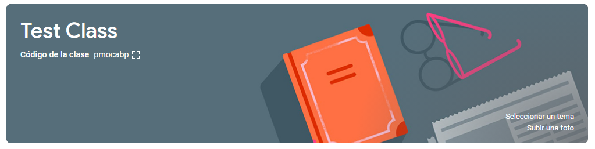

<div align="center">

# Classroom PresenteBot


</div>
<details open>
<summary><b>Tabla de contenidos</b></summary>
<ol>
<li><a href="#como-funciona">Como funciona.</a></li>
<li><a href="#instalación">Instalación.</a></li>
<li><a href="#configuración">Configuración.</a></li>
<li><a href="#ejemplo">Ejemplo de configuración.</a></li>
</ol>
</details>

## Como Funciona
No es tanto un **Bot**, si no un **Script** de Python, que haciendo de uso de la librería [PyAutoGUI](https://pyautogui.readthedocs.io/en/latest/) y otras nativas, abre una ventana del navegador en una clase de Classroom, chequea si es el dia y la hora especificada en el programa, busca la primer publicacion y comenta el mensaje programado.

Hay varios parametros de configuración pero hay 3 que son los mas importantes: `CLASS_URL`, `CLASS_HEADER_IMG` y `IMG2FIND`. Ver la sección [`Configuración`](#Configuración) para mas información.

## Instalación

En una consola, ejecutar en el siguiente orden:

`git clone https://github.com/GianK128/Classroom-PresenteBot`

`cd Classroom-PresenteBot`

`pip install -r requirements.txt`

## Configuración

Para poder configurar el 'bot', tenemos que abrir el archivo `presente-bot.py`, buscamos la seccion `MACROS` y alli podemos cambiar las variables:

`MESSAGE`: cadena de texto que contiene el mensaje que se escribe en el comentario.

`IMG2FIND`: ruta de una imagen solo del campo de comentario donde se pueda visualizar la foto de perfil. Esta sirve para ubicar el lugar donde hacer el comentario. Ver [Ejemplo](#ejemplo).

`CLASS_HEADER_IMG`: ruta una imagen del encabezado de la clase a la que pertenece la URL. Esta sirve para identificar el momento en el que se abrió correctamente el navegador. Ver [Ejemplo](#ejemplo).

`CLASS_URL`: enlace hacia la pagina de Classroom donde está la clase. Sirve para saber en que pagina abrir el navegador.

`WAITBROWSER_SECONDS`: tiempo de espera en segundos antes de continuar con el programa, luego de abrir la ventana del navegador

`WAITDATETIME_MINUTES`: intervalo en minutos entre un chequeo y otro para saber si es la hora especificada o no.

`WEEKDAY`: el día que se espera que se publique este comentario, esto puede servir para tener el programa abierto hasta el momento de comentar. Puede ser cualquiera de los siguientes valores:

```
LUNES
MARTES
MIERCOLES
JUEVES
VIERNES
SABADO
DOMINGO
```

`TIME`: el tiempo en el que se espera que se publique este comentario, esto puede servir para tener el programa abierto hasta el momento de comentar. Mantener el formato de `hh:mm` para evitar errores en el programa.

## Ejemplo

Tengo una clase en Classroom y quiero que los días Lunes, no importa la hora que ejecute el programa, me realice la escritura del comentario. Para hacerlo seguiría este proceso:

Saco una captura del encabezado de la clase y coloco su ruta en la configuración del script (`CLASS_HEADER_IMG`):



Hago lo mismo para el cuadro de comentario y coloco su ruta en la configuración (`IMG2FIND`):


Quiero que sea los días Lunes asi que establezco `WEEKDAY` como `LUNES`. Y como quiero que sea a cualquier hora, establezco `TIME` como `"00:00"`

Entonces la configuración me queda así:

```python
MESSAGE = "Hello, World!"
IMG2FIND = "images/to-find.png"
CLASS_HEADER_IMG = "images/header.png"
CLASS_URL = "URL AQUÍ"
WAITBROWSER_SECONDS = 10
WAITDATETIME_MINUTES = 10
WEEKDAY = LUNES
TIME = "00:00" 
```